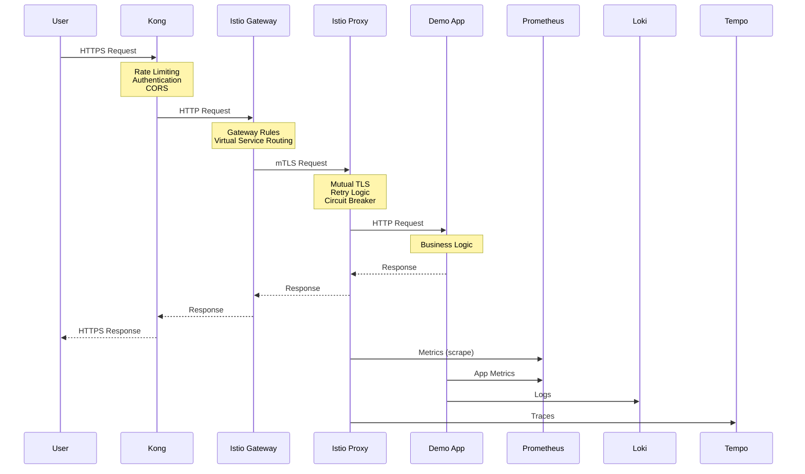
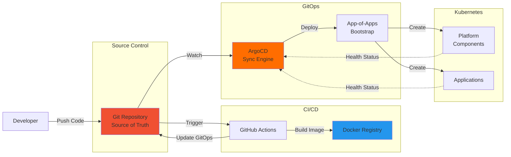
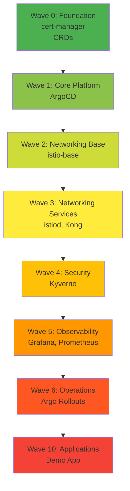
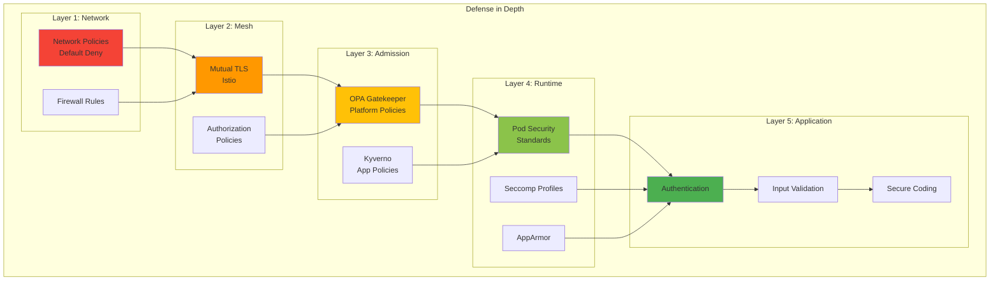
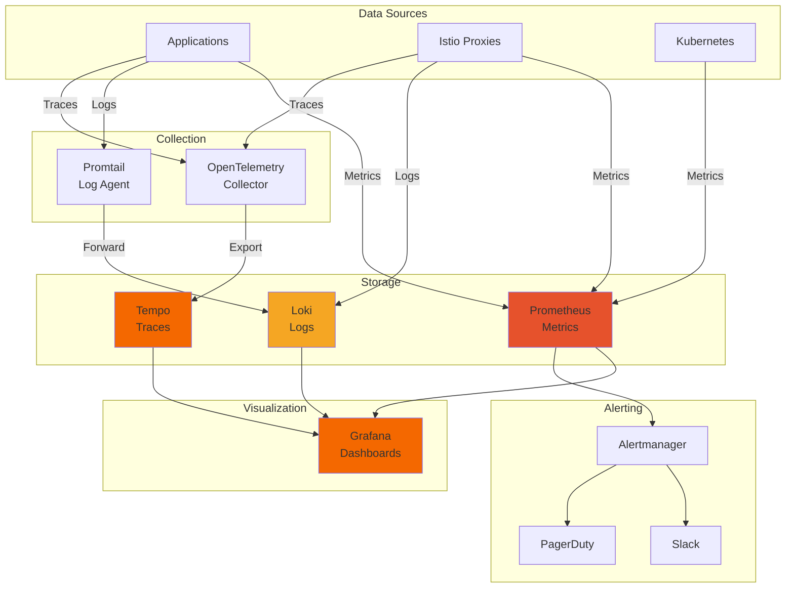
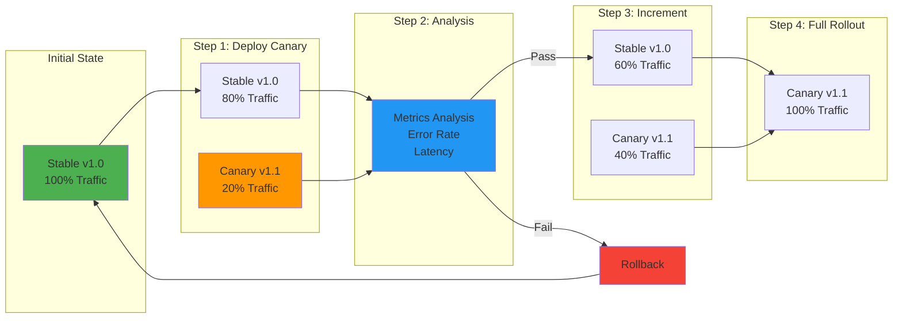
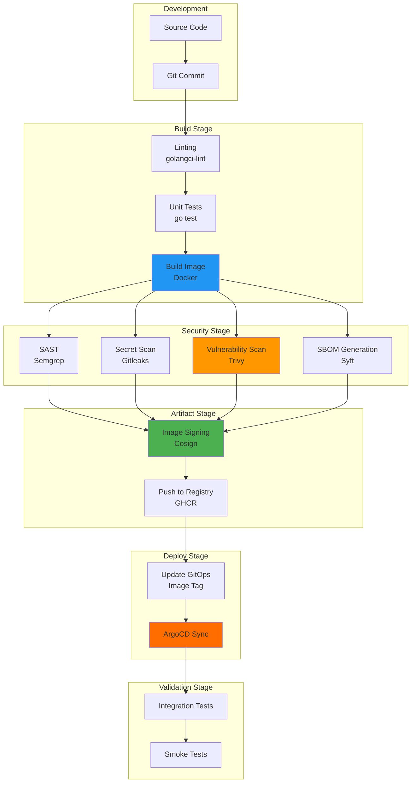

# Architecture Overview

Comprehensive architecture diagrams for the Kubernetes platform.

## High-Level Architecture

```mermaid
graph TB
    subgraph "External"
        Users[Users/Clients]
        Internet[Internet]
    end

    subgraph "Ingress Layer"
        Kong[Kong Gateway<br/>North-South Traffic]
    end

    subgraph "Service Mesh"
        Istio[Istio<br/>East-West Traffic]
        Envoy[Envoy Proxies<br/>Sidecar Pattern]
    end

    subgraph "Platform Components"
        ArgoCD[ArgoCD<br/>GitOps]
        CertManager[cert-manager<br/>TLS Certificates]
        Kyverno[Kyverno<br/>Policy Engine]
        ArgoRollouts[Argo Rollouts<br/>Progressive Delivery]
    end

    subgraph "Observability Stack"
        Grafana[Grafana<br/>Visualization]
        Prometheus[Prometheus<br/>Metrics]
        Loki[Loki<br/>Logs]
        Tempo[Tempo<br/>Traces]
    end

    subgraph "Applications"
        DemoApp[Demo App]
        OtherApps[Other Applications]
    end

    subgraph "Data Plane"
        K3s[K3s Cluster<br/>Kubernetes]
    end

    Users --> Internet
    Internet --> Kong
    Kong --> Istio
    Istio --> Envoy
    Envoy --> DemoApp
    Envoy --> OtherApps

    ArgoCD -.->|Manages| Platform Components
    ArgoCD -.->|Manages| Applications
    ArgoCD -.->|Manages| Observability Stack

    DemoApp -.->|Metrics| Prometheus
    DemoApp -.->|Logs| Loki
    DemoApp -.->|Traces| Tempo

    Prometheus --> Grafana
    Loki --> Grafana
    Tempo --> Grafana

    Kyverno -.->|Enforces| DemoApp
    CertManager -.->|TLS Certs| Kong
    ArgoRollouts -.->|Controls| DemoApp

    style Kong fill:#ff9900
    style Istio fill:#466bb0
    style ArgoCD fill:#ff6d00
    style Grafana fill:#f46800
```

## Network Flow Diagram



## GitOps Flow



## Deployment Sync Waves



## Security Architecture



## Observability Stack



## Canary Deployment Flow



## CI/CD Pipeline



## Node Architecture

```
┌─────────────────────────────────────────────────────────┐
│                     K3s Node                            │
├─────────────────────────────────────────────────────────┤
│  Control Plane (Server Node)                           │
│  ┌──────────────────────────────────────────────────┐  │
│  │ kube-apiserver                                   │  │
│  │ kube-scheduler                                   │  │
│  │ kube-controller-manager                          │  │
│  │ etcd                                             │  │
│  └──────────────────────────────────────────────────┘  │
│                                                         │
│  Data Plane                                            │
│  ┌──────────────────────────────────────────────────┐  │
│  │ kubelet                                          │  │
│  │ kube-proxy                                       │  │
│  │ containerd                                       │  │
│  └──────────────────────────────────────────────────┘  │
│                                                         │
│  Pods                                                  │
│  ┌─────────────┐  ┌─────────────┐  ┌──────────────┐  │
│  │ Demo App    │  │ Grafana     │  │ ArgoCD       │  │
│  │ ┌─────────┐ │  │ ┌─────────┐ │  │ ┌──────────┐ │  │
│  │ │App      │ │  │ │Grafana  │ │  │ │ArgoCD    │ │  │
│  │ │Container│ │  │ │Container│ │  │ │Server    │ │  │
│  │ └─────────┘ │  │ └─────────┘ │  │ └──────────┘ │  │
│  │ ┌─────────┐ │  │ ┌─────────┐ │  │              │  │
│  │ │Istio    │ │  │ │Istio    │ │  │              │  │
│  │ │Proxy    │ │  │ │Proxy    │ │  │              │  │
│  │ └─────────┘ │  │ └─────────┘ │  │              │  │
│  └─────────────┘  └─────────────┘  └──────────────┘  │
│                                                         │
│  CNI: Flannel                                          │
│  CSI: Local Path Provisioner                          │
└─────────────────────────────────────────────────────────┘
```

## Resource Hierarchy

```
Cluster (k3s-extreme-lab)
│
├── Namespace: argocd
│   ├── ArgoCD Server
│   ├── ArgoCD Application Controller
│   ├── ArgoCD Repo Server
│   └── Applications (CRDs)
│       ├── root-application
│       ├── platform-apps
│       ├── application-apps
│       └── [individual component apps]
│
├── Namespace: cert-manager
│   ├── cert-manager Controller
│   ├── cert-manager Webhook
│   └── Certificates (CRDs)
│
├── Namespace: istio-system
│   ├── istiod
│   ├── Gateway (CRDs)
│   ├── VirtualService (CRDs)
│   └── PeerAuthentication (CRDs)
│
├── Namespace: kyverno
│   ├── Kyverno Controller
│   ├── ClusterPolicies (CRDs)
│   └── PolicyReports (CRDs)
│
├── Namespace: observability
│   ├── Grafana
│   ├── Prometheus
│   ├── Loki
│   └── Tempo
│
└── Namespace: demo
    ├── Demo App (Deployment/Rollout)
    │   ├── Pod (app container + istio-proxy)
    │   ├── Service
    │   ├── VirtualService
    │   └── ServiceMonitor
    └── NetworkPolicy (auto-generated by Kyverno)
```

## References

- [Kubernetes Architecture](https://kubernetes.io/docs/concepts/architecture/)
- [Istio Architecture](https://istio.io/latest/docs/ops/deployment/architecture/)
- [ArgoCD Architecture](https://argo-cd.readthedocs.io/en/stable/operator-manual/architecture/)
- [Platform Engineering](https://platformengineering.org/)
