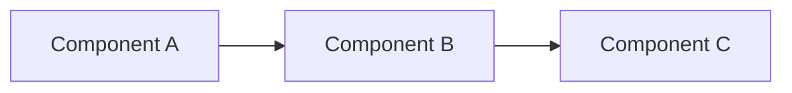

# Documentation

Comprehensive documentation for the Kubernetes Extreme Lab platform.

## Directory Structure

```
docs/
├── DECISIONS/          # Architecture Decision Records (ADRs)
├── RUNBOOKS/           # Operational procedures
├── DIAGRAMS/           # Architecture diagrams
├── API/                # API documentation
└── README.md           # This file
```

## Quick Links

### Getting Started

1. [Bootstrap New Environment](RUNBOOKS/bootstrap-new-environment.md) - Deploy the platform from scratch
2. [Architecture Overview](DIAGRAMS/architecture-overview.md) - Visual architecture diagrams
3. [GitOps README](../gitops/README.md) - Understanding the GitOps workflow

### Key Decisions

- [ADR-001: Repository Structure](DECISIONS/001-repository-structure.md) - Why monorepo?
- [ADR-002: GitOps App-of-Apps](DECISIONS/002-gitops-app-of-apps.md) - Deployment strategy
- [ADR-003: Service Mesh - Istio](DECISIONS/003-service-mesh-istio.md) - Why Istio over Linkerd?

### Operational Runbooks

- [Bootstrap New Environment](RUNBOOKS/bootstrap-new-environment.md) - Full platform deployment
- [Incident Response: Pod CrashLoop](RUNBOOKS/incident-response-pod-crashloop.md) - Troubleshoot crashes

### Technical Guides

- [Infrastructure Setup](../infrastructure/README.md) - Terraform and Ansible
- [Platform Components](../platform/README.md) - Helm charts and configurations
- [Testing Strategy](../tests/README.md) - Unit, integration, E2E tests
- [Security Practices](../security/README.md) - Scanning, policies, compliance

## Documentation Standards

### Architecture Decision Records (ADRs)

ADRs document significant architectural decisions using the following template:

```markdown
# ADR XXX: Title

**Status:** Proposed | Accepted | Deprecated | Superseded
**Date:** YYYY-MM-DD
**Deciders:** [list of people]
**Technical Story:** [link or description]

## Context
[What is the issue we're seeing that motivates this decision?]

## Decision
[What is the change we're actually proposing?]

## Rationale
[Why are we making this decision?]

## Consequences
[What becomes easier or harder to do because of this change?]

## Alternatives Considered
[What other options were evaluated?]

## References
[Links to relevant documentation]
```

**When to write an ADR:**
- Architectural pattern selection (monorepo, GitOps, service mesh)
- Technology choices (Istio vs Linkerd, OPA vs Kyverno)
- Infrastructure decisions (K3s vs K8s, Terraform vs Pulumi)
- Security policies and standards
- Deployment strategies

### Runbooks

Runbooks provide step-by-step operational procedures:

```markdown
# Runbook: Title

**Purpose:** [What this runbook achieves]
**Audience:** [Who should use this]
**Estimated Time:** [How long it takes]
**Risk Level:** Low | Medium | High

## Prerequisites
- [ ] Checklist item 1
- [ ] Checklist item 2

## Step 1: Title
[Detailed instructions with commands]

## Troubleshooting
[Common issues and solutions]

## References
[Links to related documentation]
```

**When to write a runbook:**
- Common operational tasks (deployments, upgrades, rollbacks)
- Incident response procedures
- Troubleshooting guides
- Disaster recovery processes
- Onboarding and offboarding

### Diagrams

Use Mermaid for inline diagrams (renders on GitHub):



**Diagram types:**
- Architecture diagrams (high-level system design)
- Sequence diagrams (interaction flows)
- Network diagrams (traffic flows)
- Deployment diagrams (sync waves, rollouts)
- Security diagrams (defense in depth)

## Contributing to Documentation

### Adding a New ADR

1. **Create file:** `docs/DECISIONS/NNN-title.md`
2. **Use template** from standards above
3. **Number sequentially** (001, 002, 003...)
4. **Update index** (this README)
5. **Commit with message:** `docs: add ADR-NNN for [topic]`

### Adding a New Runbook

1. **Create file:** `docs/RUNBOOKS/task-name.md`
2. **Use template** from standards above
3. **Test procedures** before committing
4. **Update index** (this README)
5. **Link from relevant places** (platform README, tools, etc.)

### Updating Diagrams

1. **Edit Mermaid source** in `docs/DIAGRAMS/`
2. **Verify rendering** on GitHub or with Mermaid Live Editor
3. **Update references** if diagram URL changes
4. **Commit with clear message**

## Documentation Maintenance

### Review Schedule

- **ADRs:** Review quarterly, update status if superseded
- **Runbooks:** Review after each use, update based on feedback
- **Diagrams:** Update with architecture changes
- **API Docs:** Generate automatically from code

### Deprecation Process

1. **Mark as deprecated** in document header
2. **Add deprecation notice** at top of document
3. **Link to replacement** documentation
4. **Keep for 6 months** before archiving
5. **Move to `docs/ARCHIVE/`** after deprecation period

### Documentation Health Checks

Run these checks periodically:

```bash
# Check for broken links
find docs -name "*.md" -exec grep -l "http" {} \; | xargs -I {} echo "Check links in: {}"

# Check ADR numbering
ls docs/DECISIONS/*.md | sort

# List runbooks without updates in 6+ months
find docs/RUNBOOKS -name "*.md" -mtime +180

# Verify all tools/scripts are documented
diff <(ls tools/scripts/*.sh | xargs -n1 basename) <(grep -r "tools/scripts" docs | grep -oP '[\w-]+\.sh' | sort -u)
```

## Related Documentation

### Platform Components

| Component | Documentation | Config |
|-----------|---------------|--------|
| ArgoCD | [ArgoCD Docs](https://argo-cd.readthedocs.io/) | [platform/core/argocd/](../platform/core/argocd/) |
| Istio | [Istio Docs](https://istio.io/latest/docs/) | [platform/networking/istio/](../platform/networking/istio/) |
| Kong | [Kong Docs](https://docs.konghq.com/) | [platform/networking/kong/](../platform/networking/kong/) |
| Kyverno | [Kyverno Docs](https://kyverno.io/docs/) | [platform/security/kyverno/](../platform/security/kyverno/) |
| Grafana | [Grafana Docs](https://grafana.com/docs/) | [platform/observability/grafana/](../platform/observability/grafana/) |

### External References

- [Kubernetes Documentation](https://kubernetes.io/docs/)
- [CNCF Landscape](https://landscape.cncf.io/)
- [Platform Engineering Guide](https://platformengineering.org/)
- [GitOps Principles](https://opengitops.dev/)
- [12 Factor App](https://12factor.net/)

## Support and Feedback

### Getting Help

1. **Check runbooks** for operational procedures
2. **Review ADRs** for architectural context
3. **Search GitHub issues** for similar problems
4. **Ask in team chat** (Slack #platform channel)
5. **Create issue** if documentation is unclear

### Improving Documentation

Found an issue or have a suggestion?

1. **Quick fixes:** Create a PR directly
2. **Major changes:** Open an issue first to discuss
3. **Questions:** Add as discussion in PR/issue
4. **Feedback:** Share in team retrospectives

### Documentation Checklist

Before submitting documentation PR:

- [ ] Followed template structure
- [ ] Tested all commands/procedures
- [ ] Added links to related docs
- [ ] Updated index (this README)
- [ ] Checked spelling and grammar
- [ ] Verified diagrams render correctly
- [ ] Added examples where helpful

## License and Attribution

This documentation is maintained by the Platform Team.

**Contributors:** [See Git history]

**License:** Internal use only
