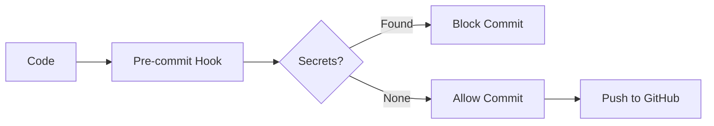
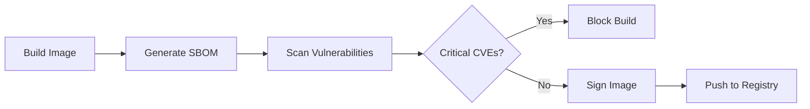
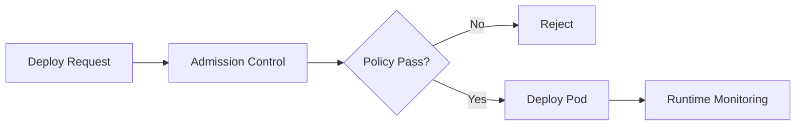
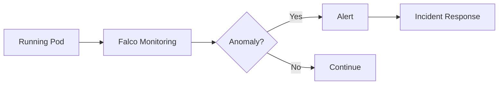

# Security

Centralized security tooling, scanning, and compliance documentation.

## Directory Structure

```
security/
├── sbom/                          # Software Bill of Materials
│   ├── README.md                 # SBOM generation guide
│   └── .gitignore                # Don't commit SBOMs
│
├── vulnerabilities/               # Vulnerability scan reports
│   ├── README.md                 # Scanning guide
│   └── .gitignore                # Don't commit reports
│
├── compliance/                    # Compliance reports
│   └── cis-benchmarks.md         # CIS Kubernetes Benchmark
│
└── secrets-scanning/              # Secret detection
    ├── gitleaks.toml             # Gitleaks configuration
    └── .gitleaksignore           # False positive exclusions
```

## Security Layers

### 1. Supply Chain Security

**Image Signing** (Cosign)

```bash
# Sign image
cosign sign --key cosign.key ghcr.io/user/demo-app:1.0.0

# Verify signature
cosign verify --key cosign.pub ghcr.io/user/demo-app:1.0.0
```

**SBOM Generation** (Syft)

```bash
# Generate SBOM
syft demo-app:1.0.0 -o spdx-json > security/sbom/demo-app-1.0.0.json
```

**Provenance** (SLSA)

- Build provenance attestations
- Reproducible builds
- Verified source-to-deployment chain

### 2. Vulnerability Management

**Container Scanning** (Trivy)

```bash
# Scan image
trivy image demo-app:1.0.0 --severity HIGH,CRITICAL

# Scan filesystem
trivy fs applications/demo-app/

# Scan IaC
trivy config infrastructure/terraform/
```

**Dependency Scanning** (Grype)

```bash
# Scan image
grype demo-app:1.0.0

# Scan SBOM
grype sbom:security/sbom/demo-app-1.0.0.json
```

### 3. Secret Detection

**Pre-commit Hook** (Gitleaks)

```bash
# Install pre-commit hook
brew install gitleaks
gitleaks protect --staged

# Scan entire repository
gitleaks detect --source . --config security/secrets-scanning/gitleaks.toml
```

**CI/CD Scanning**

```yaml
# .github/workflows/security.yaml
- name: Gitleaks
  uses: gitleaks/gitleaks-action@v2
  env:
    GITHUB_TOKEN: ${{ secrets.GITHUB_TOKEN }}
```

### 4. Runtime Security

**Falco** (Runtime threat detection)

- Monitors system calls
- Detects anomalous behavior
- Alerts on policy violations

**Policies:**
- Unexpected process execution
- File system changes
- Network connections
- Privilege escalation

### 5. Admission Control

**OPA Gatekeeper** (Policy enforcement)

```bash
# Install Gatekeeper
kubectl apply -f https://raw.githubusercontent.com/open-policy-agent/gatekeeper/master/deploy/gatekeeper.yaml

# Apply policies
kubectl apply -f policies/opa/
```

**Kyverno** (Kubernetes-native policies)

```bash
# Apply policies
kubectl apply -f policies/kyverno/

# View policy reports
kubectl get policyreport -A
```

### 6. Network Security

**Network Policies** (Default deny)

```yaml
apiVersion: networking.k8s.io/v1
kind: NetworkPolicy
metadata:
  name: default-deny-all
spec:
  podSelector: {}
  policyTypes:
    - Ingress
    - Egress
```

**Service Mesh** (Istio mTLS)

- Automatic mutual TLS
- Zero-trust networking
- Encrypted service-to-service communication

### 7. Compliance

**CIS Benchmarks** (kube-bench)

```bash
# Scan cluster
docker run --rm -v /etc:/etc:ro -v /var:/var:ro aquasec/kube-bench:latest run --targets node,policies
```

**PCI-DSS, SOC2, HIPAA**

- Pod Security Standards
- RBAC least privilege
- Audit logging
- Encryption at rest/in-transit

## Security Workflow

### Development Phase



1. **Pre-commit hooks** scan for secrets
2. **IDE plugins** detect issues early
3. **Linters** enforce secure coding practices

### Build Phase



1. **SAST** (Semgrep) scans source code
2. **SBOM** generated with Syft
3. **Vulnerability scanning** with Trivy/Grype
4. **Image signing** with Cosign

### Deployment Phase



1. **Admission webhooks** validate resources
2. **Policy enforcement** via OPA/Kyverno
3. **Image verification** (signature check)
4. **Runtime monitoring** with Falco

### Runtime Phase



1. **Continuous scanning** of running images
2. **Behavioral monitoring** with Falco
3. **Log analysis** for security events
4. **Incident response** procedures

## Security Tools

| Tool | Purpose | Integration |
|------|---------|-------------|
| **Trivy** | Vulnerability scanning | CI/CD, CLI |
| **Grype** | SBOM-based scanning | CI/CD, CLI |
| **Syft** | SBOM generation | CI/CD |
| **Cosign** | Image signing | CI/CD |
| **Gitleaks** | Secret detection | Pre-commit, CI/CD |
| **Semgrep** | SAST | CI/CD |
| **kube-bench** | CIS compliance | Scheduled |
| **Falco** | Runtime security | DaemonSet |
| **OPA Gatekeeper** | Admission control | Webhook |
| **Kyverno** | Policy engine | Webhook |

## Security Checklist

### Container Security

- [ ] Non-root user (UID > 1000)
- [ ] Read-only root filesystem
- [ ] Drop all capabilities
- [ ] No privilege escalation
- [ ] Resource limits defined
- [ ] Minimal base image (scratch/distroless)
- [ ] Image signed with Cosign
- [ ] SBOM generated
- [ ] No HIGH/CRITICAL CVEs

### Kubernetes Security

- [ ] RBAC least privilege
- [ ] Service accounts per app
- [ ] Network policies defined
- [ ] Pod Security Standards enforced
- [ ] Secrets encrypted at rest
- [ ] Audit logging enabled
- [ ] Admission controllers configured
- [ ] CIS benchmark compliance

### Application Security

- [ ] TLS for all traffic
- [ ] Input validation
- [ ] Output encoding
- [ ] Authentication required
- [ ] Authorization enforced
- [ ] Rate limiting
- [ ] Secure dependencies
- [ ] No hardcoded secrets

### Infrastructure Security

- [ ] Encrypted volumes
- [ ] Secure boot
- [ ] Firewall rules
- [ ] SSH key-based auth
- [ ] Regular patching
- [ ] Intrusion detection
- [ ] Backup encryption
- [ ] Disaster recovery plan

## Incident Response

### 1. Detection

- Falco alert
- Vulnerability scan
- Manual report

### 2. Assessment

```bash
# Check pod security context
kubectl get pod <pod> -n <namespace> -o jsonpath='{.spec.securityContext}'

# Check running processes
kubectl exec <pod> -n <namespace> -- ps aux

# Check network connections
kubectl exec <pod> -n <namespace> -- netstat -tulpn
```

### 3. Containment

```bash
# Isolate pod with NetworkPolicy
kubectl apply -f - <<EOF
apiVersion: networking.k8s.io/v1
kind: NetworkPolicy
metadata:
  name: isolate-compromised-pod
  namespace: <namespace>
spec:
  podSelector:
    matchLabels:
      app: <compromised-app>
  policyTypes:
    - Ingress
    - Egress
EOF

# Or delete pod immediately
kubectl delete pod <pod> -n <namespace>
```

### 4. Eradication

- Remove malicious resources
- Patch vulnerabilities
- Rotate credentials
- Update policies

### 5. Recovery

- Restore from known-good state
- Redeploy patched version
- Monitor for recurrence

### 6. Post-Incident

- Write post-mortem
- Update runbooks
- Improve detection
- Train team

## References

- [OWASP Kubernetes Security Cheat Sheet](https://cheatsheetseries.owasp.org/cheatsheets/Kubernetes_Security_Cheat_Sheet.html)
- [NSA Kubernetes Hardening Guide](https://media.defense.gov/2022/Aug/29/2003066362/-1/-1/0/CTR_KUBERNETES_HARDENING_GUIDANCE_1.2_20220829.PDF)
- [CIS Kubernetes Benchmark](https://www.cisecurity.org/benchmark/kubernetes)
- [Kubernetes Security Best Practices](https://kubernetes.io/docs/concepts/security/security-best-practices/)
